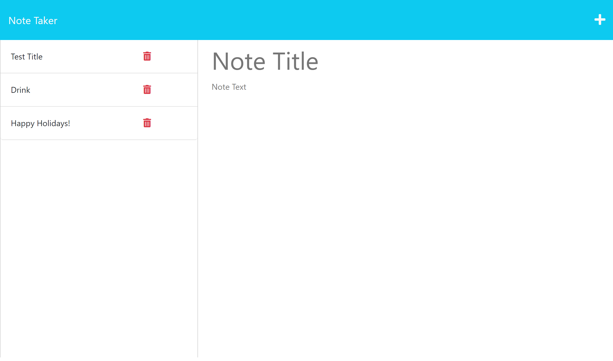

# <u>**Week 11 Challenge**</u>
This weeks challenge focused on our abilities to utilize express.js to create the proper routes on our note taker application. 

## Deployed Webpage
[Click here to go to see my Note Taking App!](https://desolate-retreat-97611.herokuapp.com/notes)

## <u>**Motivation**</u>
Here is a list of my motivations for this project!

- learn how to properly use express.js as a back end serves
- learn how to create routes based on given starter code
- work with Heroku for the first time to host our deployed page
 

## <u>**Screenshots**</u>

## <u>**Author**</u>

Tyler Walton  
Tylerwalton300@gmail.com